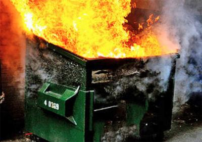

# Infrastructure

(Note that this README is likely to become out of date very quickly.)

What version are we on now? v7? I don't even know anymore. I give up.

If you paste the link to this repo in a social media site or a chat app, you will most likely see this image:

This is an image of a dumpster fire. This is because this repo is a dumpster fire.

In any case, this does configure a bunch of things under my possession. As of 2025-08-11, I am in the middle of a rewrite of this repo.
